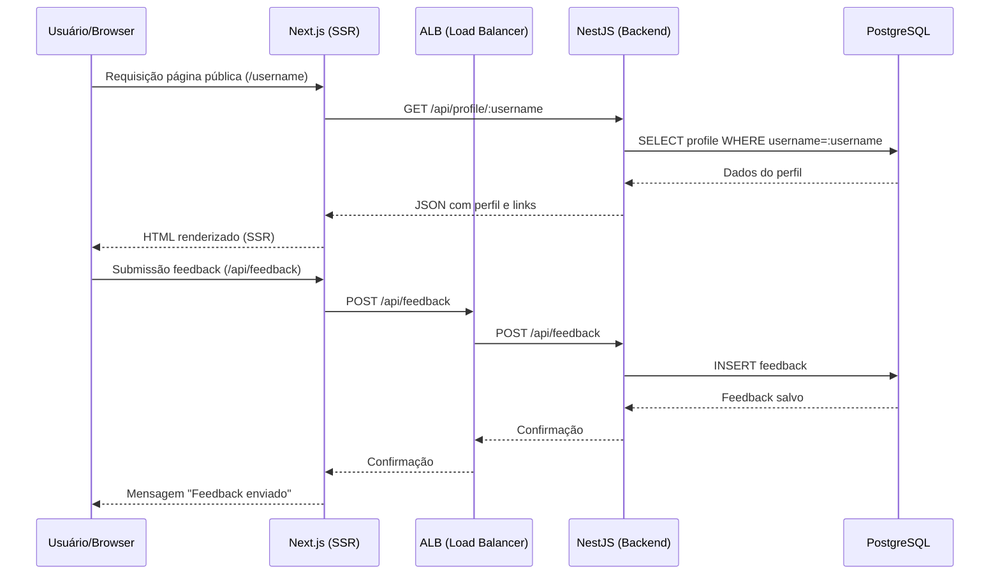

Perfeito! Vou te ajudar a estruturar um **README.md** profissional para explicar suas decisões no exercício do MVP da plataforma *Insightly*. Ele deve ser claro, detalhado e mostrar o raciocínio técnico por trás de cada escolha. Aqui está uma sugestão de estrutura e conteúdo:

---

# README - MVP Plataforma "Insightly"

## 🏢 Contexto do Projeto

**Insightly** é uma startup fictícia que permite criadores de conteúdo:

* Criar uma página pública com links das suas redes sociais.
* Receber feedback anônimo de seus seguidores.

O MVP foi desenvolvido com foco em **simplicidade, escalabilidade e SEO**, contemplando três pilares principais: autenticação, página pública e feedback.

---

## 📝 Objetivo do Exercício

O desafio consistiu em construir do zero um **MVP funcional**, tomando decisões de arquitetura, implementando funcionalidades core e preparando a infraestrutura para deploy.

---

## 🛠 Tecnologias Utilizadas

| Camada         | Tecnologia                | Justificativa                                                       |
| -------------- | ------------------------- | ------------------------------------------------------------------- |
| Backend        | NestJS + TypeScript       | Estrutura modular, suporte a REST e fácil testabilidade             |
| Frontend       | NextJS + TypeScript (SSR) | SSR/SSG nativo para SEO, integração simples com API                 |
| Banco de Dados | PostgreSQL                | Relacional, confiável, escalável                                    |
| Infraestrutura | AWS (EC2, ALB)            | Deploy rápido, balanceamento de carga, monitoramento via CloudWatch |
| Segurança      | HTTPS via ACM + Nginx     | Criptografia TLS, segurança do tráfego                              |
| Testes         | Jest (unitários NestJS)   | Garantia de qualidade e cobertura das principais funcionalidades    |

---

## ⚙️ Arquitetura do MVP

O diagrama abaixo mostra o fluxo principal da aplicação:

**Decisões importantes na arquitetura:**

* **SSR via Next.js**: garante SEO otimizado para páginas públicas e carregamento rápido.
* **ALB (Load Balancer)**: permite escalabilidade futura do backend NestJS e health checks automáticos.
* **Banco de dados PostgreSQL**: escolhida por confiabilidade e suporte a relacionamentos complexos entre usuários, links e feedbacks.
* **Frontend e backend no mesmo EC2 (inicialmente)**: simplifica deploy e gerenciamento de infraestrutura.

---

## 🖥 Funcionalidades Implementadas

### Sistema de Autenticação e Gestão de Perfil

* Registro/login via email e senha.
* Edição de perfil: nome, biografia.
* CRUD de links: título + URL.

### Página de Perfil Pública

* URL única para cada usuário (`/username`).
* Renderizada via SSR para SEO.
* Exibe nome, biografia e lista de links.
* Feedback anônimo: qualquer visitante pode enviar mensagens.

### Sistema de Feedback

* Feedbacks armazenados no banco e apresentados ao criador logado.
* Ordenação do mais recente para o mais antigo.

---

## 🔧 Infraestrutura e Deploy

* **EC2 Ubuntu**: hospeda backend e frontend SSR.
* **ALB**: roteia requisições da API para backend e monitora saúde da instância.
* **Nginx**: opcional, usado para unificar backend + frontend e HTTPS.
* **HTTPS via ACM**: segurança de tráfego.

**Fluxo de deploy:**

1. Instalar dependências no backend e frontend.
2. Rodar backend NestJS (`npm run start:dev`).
3. Rodar frontend Next.js SSR (`npm run dev`).
4. Configurar ALB para rotear `/api` para porta 4000 do backend.

---

## 💡 Decisões Estratégicas

1. **SSR para SEO**: essencial para páginas públicas de criadores.
2. **Separação de frontend/backend**: permite escalabilidade e testes independentes.
3. **AWS EC2 + ALB**: simples, confiável e permite escalabilidade futura.
4. **PostgreSQL relacional**: garante integridade entre usuários, links e feedbacks.
5. **Testes unitários com Jest**: valida funcionalidades críticas do backend.

---

## 🔜 Próximos Passos

* Configurar Nginx para unificar frontend + backend com HTTPS.
* Adicionar domínio próprio via Route 53 + ACM.
* Automatizar deploy com scripts CI/CD.
* Implementar testes de integração adicionais.

---

